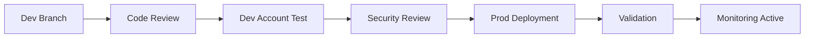
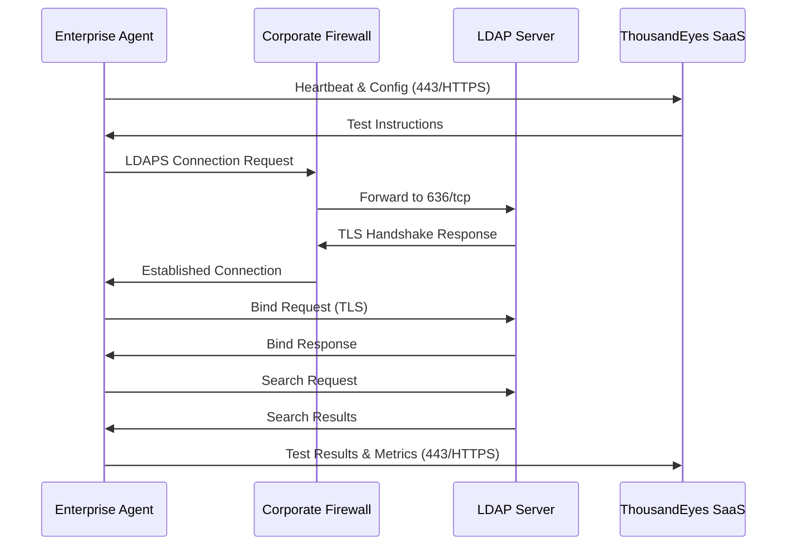

# ThousandEyes LDAP Monitoring Design Document

## Executive Summary

This document outlines the implementation of enterprise-grade LDAP monitoring using ThousandEyes' synthetic monitoring platform. The solution leverages our existing `ldap-monitor.js` script within Web Transaction tests to provide comprehensive LDAP/LDAPS connectivity and performance monitoring across multiple geographic regions.

## 1. Logical Architecture

### 1.1 System Components

- **ThousandEyes SaaS Control Plane**: Centralized orchestration and data collection
- **Enterprise Agents**: Distributed synthetic monitoring agents in each region
- **LDAP Servers**: Target authentication servers (port 636/LDAPS)
- **Firewall Infrastructure**: Network security boundaries requiring rule updates

### 1.2 Architecture Principles

- **Regional Isolation**: Agents monitor only LDAP servers within their region
- **Secure by Design**: All communications use TLS encryption (443 for control, 636 for LDAP)
- **Least Privilege**: Minimal credential scope with dedicated monitoring accounts
- **High Availability**: Agent clusters provide redundancy and failover

## 2. Connectivity & Firewall Requirements

### 2.1 Required Egress Rules

The following stateful firewall rules must be implemented:

```
# ThousandEyes Control Plane Communication
Source: Enterprise_Agent_Subnets
Destination: *.thousandeyes.com
Port: 443/tcp
Protocol: HTTPS
Purpose: Agent-to-SaaS communication

# LDAP Server Health Checks  
Source: Enterprise_Agent_Subnets
Destination: LDAP_Server_IPs
Port: 636/tcp
Protocol: LDAPS
Purpose: Synthetic monitoring probes
```

### 2.2 Security Considerations

- **Stateful Connections**: All rules are outbound-only with established return traffic
- **Regional Segmentation**: Agents access only same-region LDAP servers
- **TLS Enforcement**: TLS 1.2 minimum (1.3 preferred) for all connections

## 3. Agent-to-Server Mapping

### 3.1 Regional Distribution

| Region | Agent IDs | Target LDAP Servers |
|--------|-----------|-------------------|
| EMEA | `ag-123456`, `ag-123457` | `ldap-emea-01.corp.com`, `ldap-emea-02.corp.com` |
| AMER | `ag-234567`, `ag-234568` | `ldap-amer-01.corp.com`, `ldap-amer-02.corp.com` |
| APAC | `ag-345678`, `ag-345679` | `ldap-apac-01.corp.com`, `ldap-apac-02.corp.com` |

### 3.2 Isolation Benefits

- **Reduced Latency**: Local region testing minimizes network overhead
- **Fault Isolation**: Regional issues don't affect global monitoring
- **Compliance**: Data residency requirements satisfied

## 4. Monitoring Capabilities & Validation

### 4.1 Comprehensive Service Validation

This monitoring solution provides multi-layered validation across all critical LDAP service dimensions:

#### Network Layer Validation
- **TCP Reachability**: Confirms connectivity to port 636 through corporate firewalls
- **Network Path Integrity**: Validates end-to-end routing across regions
- **Firewall Rule Compliance**: Proves egress rules are properly configured

#### Security Layer Validation  
- **LDAPS Certificate Validation**: Verifies certificate chain, expiration, and CA trust
- **TLS Protocol Compliance**: Enforces TLS 1.2+ encryption standards
- **Hostname Verification**: Ensures certificate matches target FQDN

#### Application Layer Validation
- **LDAP Service Functionality**: Confirms authentication service is operational via bind operations
- **Directory Query Capability**: Validates search operations against Root DSE
- **Protocol Compliance**: Tests LDAPv3 specification adherence
- **Credential Validation**: Proves monitoring service accounts are functional

#### Performance Monitoring
- **Connection Latency**: TCP + TLS handshake timing (baseline: <100ms)
- **Bind Operation Performance**: Authentication response time (threshold: <300ms)
- **Search Query Performance**: Directory lookup latency (threshold: <300ms)
- **Total Transaction Time**: End-to-end operation duration for SLA reporting

### 4.2 Business Impact Metrics

| Metric | Target | Business Value |
|--------|--------|---------------|
| Availability SLA | 99.9% | User authentication reliability |
| Response Time | <300ms | Optimal user experience |
| Detection Time | <5 minutes | Rapid incident response |
| Regional Coverage | 100% | Global service assurance |

## 5. ThousandEyes Configuration

### 5.1 Web Transaction Test Template

```javascript
// Web Transaction Test Configuration
{
  "testType": "web-transaction",
  "testName": "LDAP Health Check - {REGION}",
  "interval": 300,
  "timeout": 30,
  "browserBot": "chrome-latest",
  "script": "ldap-monitor.js"
}
```

### 4.2 Secure Credentials Setup

Configure in ThousandEyes dashboard:
- **`ldapMonUser`**: `cn=monitor,ou=service,dc=corp,dc=com`
- **`ldapMonPass`**: Dedicated monitoring account password

### 5.3 Alert Rule Configuration

```
Alert Name: LDAP Service Failure
Condition: Status = Fail
Threshold: 3 consecutive rounds
Severity: Critical
Notification: PagerDuty + Email
```

## 6. Terraform Infrastructure as Code

### 6.1 Module Structure

```hcl
# main.tf
module "ldap_monitoring" {
  source = "./modules/thousandeyes-ldap"
  
  ldap_servers = [
    {
      name = "ldap-emea-01.corp.com"
      region = "emea"
      agents = ["ag-123456", "ag-123457"]
    },
    {
      name = "ldap-amer-01.corp.com"
      region = "amer"
      agents = ["ag-234567", "ag-234568"]
    }
  ]
  
  account_group_id = var.account_group_id
  alert_rules = {
    email_addresses = ["sre-team@corp.com"]
    pagerduty_key = var.pagerduty_integration_key
  }
}

# Provider configuration
provider "thousandeyes" {
  token = var.te_token
}
```

### 6.2 Environment Variables

```bash
export TE_TOKEN="your-api-bearer-token"
export TF_VAR_account_group_id="12345"
export TF_VAR_pagerduty_integration_key="integration-key"
```

## 7. Deployment Workflow

### 7.1 CI/CD Pipeline Stages



### 7.2 Access Control Requirements

- **Account Admin Role**: Required for test creation/modification
- **API Token Scope**: Limited to specific account groups
- **Approval Gates**: Security team sign-off for firewall changes

### 7.3 Rollback Strategy

- **Terraform State Backup**: Automated before each deployment
- **Test Disable**: Immediate via API if issues detected
- **Firewall Rollback**: Coordinated with network team

## 8. Operational Considerations

### 8.1 High Availability Design

> **HA Strategy**: Deploy 2+ agents per region with automatic failover

- **Agent Clustering**: Multiple agents ensure service continuity
- **Health Monitoring**: Agents monitored for availability
- **Automatic Failover**: ThousandEyes handles agent failures transparently

### 8.2 Security Operations

#### Credential Rotation
- **Monthly Rotation**: Automated via secrets management
- **Zero-Downtime**: Staged credential updates
- **Audit Trail**: All changes logged with approval workflow

#### Monitoring & Alerting
- **Real-time Alerts**: PagerDuty integration for critical failures
- **Trend Analysis**: Historical performance data for capacity planning
- **Compliance Reporting**: Automated SLA reporting

### 8.3 Maintenance Windows

- **Planned Maintenance**: Coordinated agent updates during low-traffic periods
- **Emergency Response**: 24/7 on-call escalation procedures
- **Change Management**: All modifications via approved change requests

## 9. Network Flow Diagram



## 10. Success Metrics & KPIs

- **Availability SLA**: 99.9% uptime target
- **Performance Threshold**: <300ms bind/search operations
- **Alert Response**: <5 minutes mean time to detection
- **Coverage**: 100% of production LDAP servers monitored

## 11. Assumptions & Dependencies

- **Network Connectivity**: Firewall team approval for 636/tcp egress
- **Agent Deployment**: Existing ThousandEyes Enterprise Agents operational
- **Credential Management**: LDAP monitoring accounts provisioned
- **Change Management**: Standard enterprise change approval process

---

**Next Steps**: Pending firewall approval, deployment can commence within 2-3 business days following standard change management procedures. 